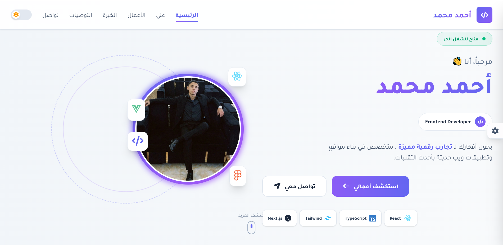
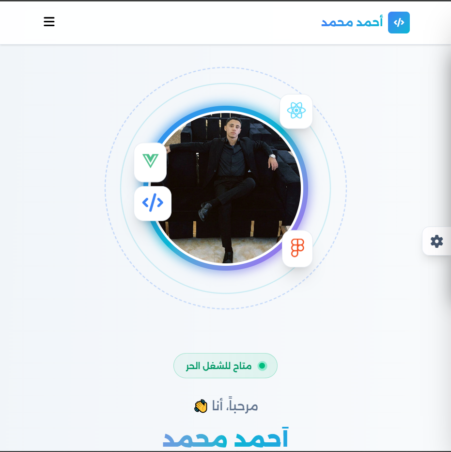
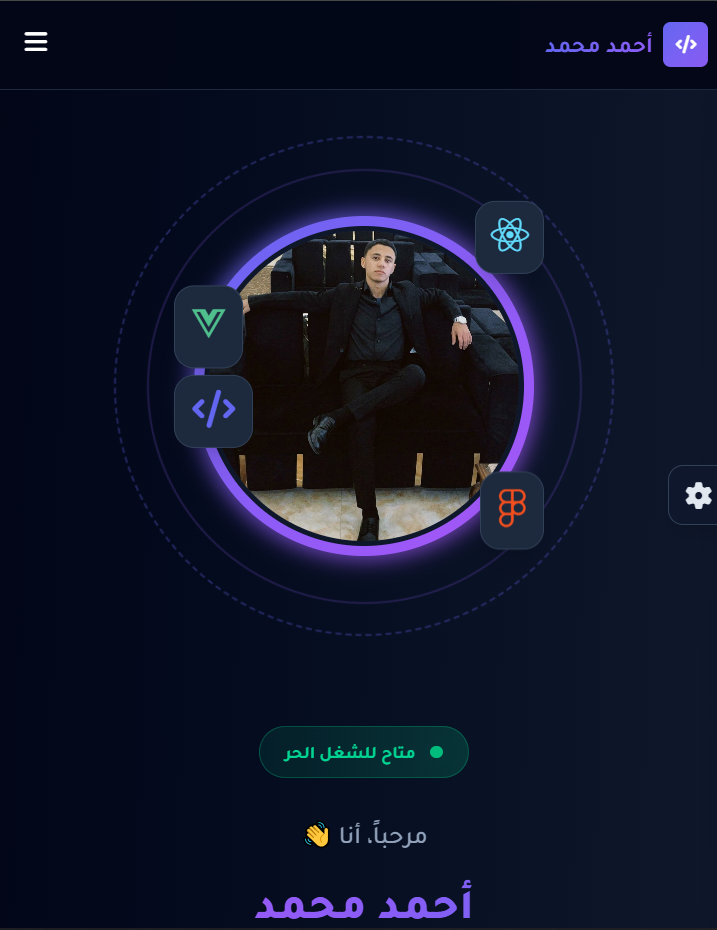

<div align="center">

# 💼 Ahmed Mohammed Portfolio

### Modern • Responsive • Interactive Front-End Portfolio

<p>
A personal portfolio website built with <strong>HTML5</strong>, <strong>Tailwind CSS</strong>, and <strong>Vanilla JavaScript</strong>.
Designed to showcase my projects, skills, certifications, and front-end development journey.
</p>


<br><br>

<a href="https://ahmedmohammed52.github.io/portfolio/" target="_blank">
    
</a>

<a href="#">
    
</a>

<br><br>


</div>

---

# 📑 Table of Contents

- About
- Features
- Screenshots
- Tech Stack
- Folder Structure
- Getting Started
- Customization
- JavaScript Features
- Responsive Design
- Browser Support
- Future Improvements
- Author

---

# 📌 About

This portfolio represents my journey as a Front-End Developer.

The main goal of this project was to build a modern, responsive, and interactive portfolio without relying on UI frameworks such as React.

Everything was built from scratch using HTML5, Tailwind CSS, and Vanilla JavaScript while focusing on clean code, reusable functions, smooth user experience, and responsive layouts.

---

# ✨ Features

## 🎨 User Interface

- Modern UI Design
- Clean Layout
- Fully Responsive
- Smooth Animations
- Beautiful Gradients
- Glassmorphism Effects
- Interactive Hover Effects

---

## ⚡ Functionality

- Dark / Light Mode
- Theme Color Switcher
- Font Switcher
- Save User Preferences
- Reset Settings
- Animated Typing Effect
- Portfolio Filtering
- Testimonial Carousel
- Active Navigation
- Mobile Navigation
- Sidebar Settings
- Smooth Scrolling
- Local Storage Support

---

## 📱 Responsive

- Desktop
- Laptop
- Tablet
- Mobile

---

# 📸 Screenshots

<p align="center">



</p>

<p align="center">




</p>

---

# 🛠 Tech Stack

| Technology      | Description      |
| --------------- | ---------------- |
| HTML5           | Structure        |
| Tailwind CSS    | Styling          |
| JavaScript ES6+ | Functionality    |
| LocalStorage    | Save Preferences |
| Font Awesome    | Icons            |

---

# 📂 Folder Structure

```

Portfolio
│
├── assets
│   ├── cv
│   ├── gif
│   ├── images
│   └── screenshots
│
├── dist
│   └── output.css
│
├── src
│   ├── input.css
│   └── js
│       └── main.js
│
├── index.html
├── package.json
└── README.md

```

---

# 🚀 Getting Started

Clone the repository

```bash
git clone https://github.com/USERNAME/REPOSITORY.git
```

Open the project

```bash
cd portfolio
```

Install Dependencies

```bash
npm install
```

Run Tailwind

```bash
npm run dev
```

---

# 🎨 Customization

The portfolio allows users to customize:

- Theme Mode
- Primary Color
- Secondary Color
- Website Font

All preferences are automatically saved using Local Storage.

---

# ⚙ JavaScript Features

The project includes reusable JavaScript modules such as:

- Theme Switcher
- Font Switcher
- Color Switcher
- Portfolio Filter
- Testimonial Slider
- Navigation Active Link
- Sidebar Toggle
- Mobile Menu
- Local Storage Manager
- Typing Animation

---

# 📱 Responsive Design

Optimized for

- Desktop
- Laptop
- Tablet
- Mobile Devices

---

# 🌍 Browser Support

- Chrome
- Edge
- Firefox
- Opera
- Brave

---

# 🔮 Future Improvements

- React Version
- Next.js Version
- Multi Language Support
- Blog Section
- Project Details Page
- Contact Form Backend
- Animations Enhancement
- Performance Optimization

---

# 👨‍💻 Author

**Ahmed Mohammed**

Front-End Developer

📍 Qena, Egypt

📧 amoa.220504@gmail.com

---

### Connect with Me

- 🌐 Portfolio: https://ahmedmohammed52.github.io/portfolio/
- 💼 LinkedIn: https://www.linkedin.com/in/ahmed-mohammed-99a121267/
- 💻 GitHub: https://github.com/AhmedMohammed52
- 📧 Email: amoa.220504@gmail.com

# ⭐ If you like this project

Give it a ⭐ on GitHub.

It helps support my work and motivates me to build more awesome projects.

---

<div align="center">

Made with ❤️ by Ahmed Mohammed

</div>
